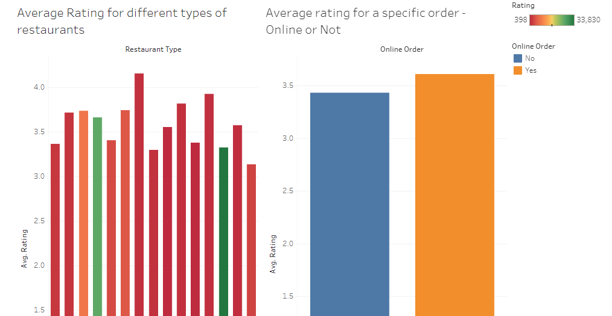

# Food-delivery-app-data-analysis
Designed and executed data cleaning techniques on a real-world database for a food delivery app.

This project has provided me with a profound comprehension of the intricacies involved in analyzing real-world databases through SQL. I delved deeper into optimizing insights from datasets, employing Python to refine data pre-processing for enhanced upcoming performance. Furthermore, I learned how to use SQL to extract valuable information from databases efficiently.

For those curious about the tools involved, here are the technologies spotlighted in this journey:

- **SQL:** The cornerstone of database analysis.
- **Python:** Empowering data preprocessing for utmost efficiency.
- **Pandas:** A tool to efficiently handle and analyze data.

Feel free to explore the [repository](repository_link) and engage with these technologies firsthand. If you have any queries or insights to share, don't hesitate to connect. Here's to embracing the art of database exploration and technological collaboration! 🚀
